# StackOverflow System - Complete UML Class Diagram

## PlantUML Code

```plantuml
@startuml StackOverflow_System

' Interfaces
interface Votable {
    + vote(user: User, voteType: VoteType): void
    + getVoteCount(): int
}

interface Commentable {
    + addComment(user: User, content: String): void
    + getComments(): List<Comment>
}

' Enums
enum VoteType {
    UPVOTE
    DOWNVOTE
}

' Main System Class
class StackOverflow {
    - users: Map<Integer, User>
    - questions: Map<Integer, Question>
    - answers: Map<Integer, Answer>
    - tags: Map<String, Tag>
    
    + StackOverflow()
    + createUsers(userName: String, email: String): User
    + askQuestion(user: User, title: String, content: String, tags: List<String>): Question
    + answerQuestion(user: User, question: Question, content: String): Answer
    + addComment(user: User, answer: Answer, content: String): Comment
    + voteQuestion(user: User, question: Question, type: VoteType): void
    + voteAnswer(user: User, answer: Answer, type: VoteType): void
    + searchQuestion(query: String): List<Question>
}

' Core Entity Classes
class User {
    - id: int
    - email: String
    - userName: String
    - reputation: int
    - questions: List<Question>
    - answers: List<Answer>
    - comments: List<Comment>
    
    + User(id: int, email: String, userName: String)
    + addQuestion(question: Question): void
    + addAnswer(question: Question, content: String): Answer
    + addComment(answer: Answer, content: String): Comment
    + getId(): int
    + setId(id: int): void
    + getEmail(): String
    + setEmail(email: String): void
    + getUserName(): String
    + setUserName(userName: String): void
    + getReputation(): int
    + setReputation(reputation: int): void
    + getQuestions(): List<Question>
    + setQuestions(questions: List<Question>): void
    + getAnswers(): List<Answer>
    + setAnswers(answers: List<Answer>): void
    + getComments(): List<Comment>
    + setComments(comments: List<Comment>): void
}

class Question {
    - id: int
    - content: String
    - title: String
    - user: User
    - answers: List<Answer>
    - tags: List<Tag>
    - votes: List<Vote>
    - acceptedAnswer: Answer
    - creationDate: Date
    
    + Question(content: String, title: String, user: User, tags: List<String>)
    + generateId(): int
    + addAnswer(answer: Answer): void
    + markAnswerAccepted(answer: Answer): void
    + vote(user: User, voteType: VoteType): void
    + getVoteCount(): int
    + getId(): int
    + setId(id: int): void
    + getContent(): String
    + setContent(content: String): void
    + getTitle(): String
    + setTitle(title: String): void
    + getUser(): User
    + setUser(user: User): void
    + getAnswers(): List<Answer>
    + setAnswers(answers: List<Answer>): void
    + getTags(): List<Tag>
    + setTags(tags: List<Tag>): void
    + getVotes(): List<Vote>
    + setVotes(votes: List<Vote>): void
    + getAcceptedAnswer(): Answer
    + setAcceptedAnswer(acceptedAnswer: Answer): void
}

class Answer {
    - id: int
    - content: String
    - user: User
    - creationDate: Date
    - isAccepted: Boolean
    - comments: List<Comment>
    - votes: List<Vote>
    
    + Answer(content: String, user: User)
    + markAnswerAccepted(): void
    + addComment(user: User, content: String): void
    + getComments(): List<Comment>
    + vote(user: User, voteType: VoteType): void
    + getVoteCount(): int
    + generateId(): int
    + makeAccepted(): void
    + getId(): int
    + setId(id: int): void
    + getContent(): String
    + setContent(content: String): void
    + getUser(): User
    + setUser(user: User): void
    + getCreationDate(): Date
    + setCreationDate(creationDate: Date): void
    + getAccepted(): Boolean
    + setAccepted(accepted: Boolean): void
    + setComments(comments: List<Comment>): void
    + getVotes(): List<Vote>
    + setVotes(votes: List<Vote>): void
    + isAccepted(): Boolean
}

class Comment {
    - id: int
    - creationDate: Date
    - user: User
    - content: String
    
    + Comment(user: User, content: String)
    + generateId(): int
}

class Vote {
    - user: User
    - voteType: VoteType
    
    + Vote(user: User, voteType: VoteType)
}

class Tag {
    - id: int
    - name: String
    
    + Tag(name: String)
    + generateId(): int
    + getId(): int
    + setId(id: int): void
    + getName(): String
    + setName(name: String): void
}

' Demo Class
class StackOverFlowDemo {
    + main(args: String[]): void
}

' Relationships
StackOverflow ||--o{ User : manages
StackOverflow ||--o{ Question : manages
StackOverflow ||--o{ Answer : manages
StackOverflow ||--o{ Tag : manages

User ||--o{ Question : asks
User ||--o{ Answer : provides
User ||--o{ Comment : makes
User ||--o{ Vote : casts

Question ||--o{ Answer : has
Question ||--o{ Tag : tagged with
Question ||--o{ Vote : receives
Question ||--|| Answer : accepts

Answer ||--o{ Comment : has
Answer ||--o{ Vote : receives

Vote }o--|| VoteType : uses

Question ..|> Votable : implements
Answer ..|> Votable : implements
Answer ..|> Commentable : implements

StackOverFlowDemo ..> StackOverflow : uses

@enduml
```

## Class Relationships Summary

### Core Relationships:
1. **StackOverflow** (Main System) manages all entities:
   - Users, Questions, Answers, Tags

2. **User** relationships:
   - Can ask multiple Questions
   - Can provide multiple Answers
   - Can make multiple Comments
   - Can cast multiple Votes

3. **Question** relationships:
   - Belongs to one User (asker)
   - Has multiple Answers
   - Has multiple Tags
   - Receives multiple Votes
   - Can have one accepted Answer

4. **Answer** relationships:
   - Belongs to one User (answerer)
   - Belongs to one Question
   - Has multiple Comments
   - Receives multiple Votes

5. **Vote** relationships:
   - Cast by one User
   - Uses one VoteType (UPVOTE/DOWNVOTE)

### Interface Implementations:
- **Question** implements **Votable**
- **Answer** implements both **Votable** and **Commentable**

### Key Design Patterns:
- **Repository Pattern**: StackOverflow class acts as a repository for all entities
- **Strategy Pattern**: VoteType enum provides different voting strategies
- **Observer Pattern**: Voting system updates user reputation

## System Features:
1. **User Management**: Create and manage users with reputation
2. **Question Management**: Ask questions with tags
3. **Answer Management**: Provide answers to questions
4. **Comment System**: Add comments to answers
5. **Voting System**: Upvote/downvote questions and answers
6. **Search Functionality**: Search questions by title, content, or tags
7. **Acceptance System**: Mark answers as accepted

This UML diagram provides a complete view of the StackOverflow system architecture, showing all classes, their relationships, and the system's functionality. 